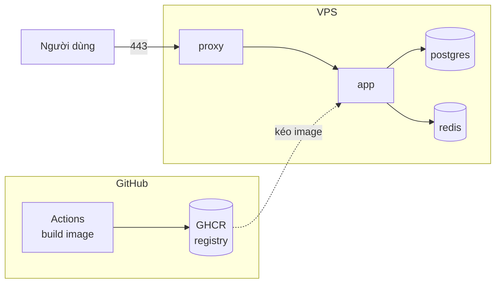
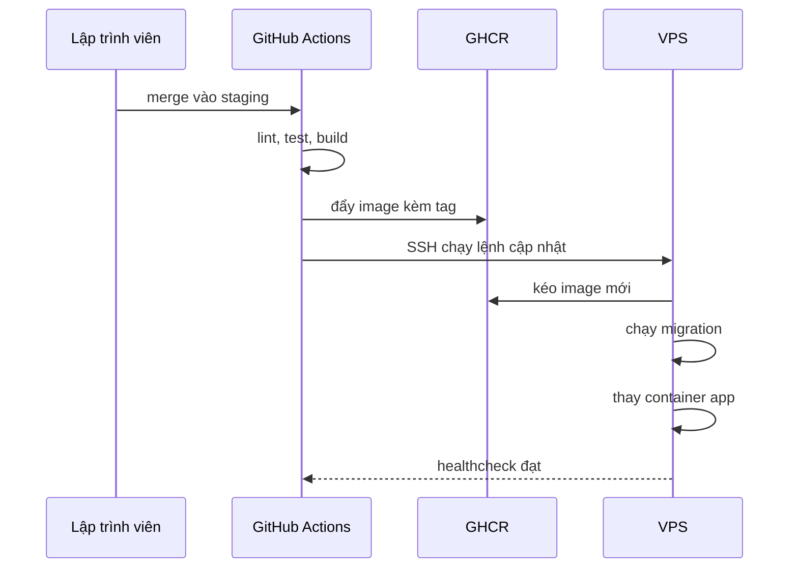

# Spec triển khai a2matex-be lên VPS

|            |                                                 |
| ---------- | ----------------------------------------------- |
| Trạng thái | Chờ review, chưa chốt 3 quyết định              |
| Ngày       | 2026-09-23                                      |
| Commit gốc | `3c3ccab`                                       |
| Phạm vi    | Đưa API lên một VPS, có HTTPS, có CI/CD tự động |

Tài liệu này là bản thiết kế, chưa có dòng code nào được viết. Mục **Quyết định còn mở** cần chốt trước khi bắt đầu.

## 1. Bối cảnh

Repo hiện chỉ có mã nguồn ứng dụng. Không có Dockerfile, không có reverse proxy, không có CI. File hạ tầng duy nhất là `tools/docker-compose.yaml`, chỉ chạy Postgres và Redis cho máy cá nhân.

Bốn lựa chọn đã chốt định hình toàn bộ thiết kế dưới đây:

| Câu hỏi           | Lựa chọn              |
| ----------------- | --------------------- |
| Cách chạy app     | Docker Compose        |
| Hiện trạng VPS    | trống, chưa chạy gì   |
| Postgres và Redis | tự chạy trên cùng VPS |
| Tự động hóa       | CI/CD tự động         |

## 2. Kiến trúc mục tiêu

GitHub lo build và lưu trữ image. VPS chỉ lo chạy.

Trên VPS có 5 container. Bốn cái chạy liên tục, một cái chạy rồi thoát.

| Container | Vai trò                   | Nguồn image                      |
| --------- | ------------------------- | -------------------------------- |
| proxy     | nhận HTTPS, chuyển về app | image chính thức, loại chưa chốt |
| app       | API NestJS                | GHCR, do CI build                |
| postgres  | cơ sở dữ liệu             | `postgres:17-alpine`             |
| redis     | cache phân quyền          | `redis:7-alpine`                 |
| migrate   | chạy migration rồi thoát  | cùng image với app               |

Postgres và Redis không mở cổng ra ngoài. Chúng nằm trên một mạng Docker đánh dấu `internal`, chỉ app gọi được. Dữ liệu nằm trong volume riêng để sống sót khi container bị thay.

Vì build diễn ra ở CI, VPS không cần biên dịch TypeScript. Cấu hình tối thiểu là 1 GB RAM.

## 3. Luồng CI/CD

Ba ràng buộc bắt buộc trong luồng này:

1. Lint và test chạy trước khi build. Hỏng thì dừng, không đẩy image lên.
2. Image gắn tag theo commit SHA, không chỉ `latest`. Nhờ vậy quay về bản cũ là trỏ sang tag cũ rồi khởi động lại, không cần build.
3. Migration chạy trước khi app đổi phiên bản. Hỏng thì app cũ vẫn chạy, không rơi vào trạng thái nửa vời.

Khóa SSH để Actions vào VPS là khóa riêng chỉ dùng cho deploy, lưu trong GitHub Secrets. Không dùng khóa cá nhân.

## 4. Các giai đoạn

Làm tuần tự. Mỗi giai đoạn có tiêu chí nghiệm thu kiểm chứng được.

### Giai đoạn 1: gỡ các chỗ chặn trong mã nguồn

Bốn chỗ khiến app không chạy được trong container. Bắt buộc, không phải lựa chọn.

| Chỗ                    | Vấn đề                                | Cách gỡ                                                           |
| ---------------------- | ------------------------------------- | ----------------------------------------------------------------- |
| `src/shared/config.ts` | thoát ngay nếu không thấy file `.env` | cho file `.env` thành tùy chọn, giữ nguyên việc kiểm tra bằng Zod |
| `src/main.ts`          | không biết có proxy đứng trước        | bật trust proxy để `@Ip()` ghi đúng IP người dùng                 |
| `src/main.ts`          | không đóng kết nối khi container dừng | bật shutdown hook cho Prisma và Redis                             |
| thiếu endpoint health  | route gốc bị guard chặn, trả 401      | thêm một route health công khai                                   |

**Nghiệm thu:** `npm run build`, `npm test`, `npm run lint` đều pass, và app khởi động được khi chỉ có biến môi trường, không có file `.env`.

### Giai đoạn 2: đóng gói

Viết `Dockerfile` nhiều stage và `.dockerignore`. Image cuối chỉ chứa bản đã biên dịch và dependency production, chạy bằng user không phải root.

**Nghiệm thu:** build được trên máy cá nhân, container chạy lên và trả 200 ở endpoint health.

### Giai đoạn 3: hạ tầng trên VPS

File Compose cho production, cấu hình proxy, volume cho dữ liệu, tường lửa, mẫu file biến môi trường.

**Nghiệm thu:** chạy toàn bộ stack trên VPS, truy cập được qua HTTPS bằng tên miền thật, đăng nhập admin và gọi được một API có phân quyền.

### Giai đoạn 4: CI/CD

Workflow GitHub Actions, thiết lập GHCR, khóa SSH riêng cho deploy, các secrets cần thiết.

**Nghiệm thu:** một commit thử đẩy lên `staging` đi được tới VPS mà không ai động tay, và quay về bản trước đó cũng thử được.

### Giai đoạn 5: vận hành

Sao lưu định kỳ, cách xem log, cách quay về bản cũ, tài liệu xử lý sự cố.

**Nghiệm thu:** khôi phục thử một bản sao lưu vào cơ sở dữ liệu trống và dữ liệu lên đủ.

## 5. Quyết định còn mở

Ba điểm cần chốt trước khi bắt đầu giai đoạn 1.

| #   | Vấn đề                                | Đề xuất                | Chốt |
| --- | ------------------------------------- | ---------------------- | ---- |
| 1   | Reverse proxy dùng gì                 | nginx kèm Certbot      | chưa |
| 2   | `package-lock.json` đang bị gitignore | commit lockfile        | chưa |
| 3   | Khi nào chạy seed permission          | tự động mỗi lần deploy | chưa |

**Điểm 1.** VPS trống nên dùng gì cũng được. Nginx phổ biến hơn hẳn, dễ tìm người hỗ trợ và tài liệu tiếng Việt. Đổi lại là phải thêm Certbot để gia hạn chứng chỉ, và cấu hình dài gấp vài lần Caddy. Caddy tự xin và tự gia hạn chứng chỉ, ít việc phải làm về sau, nhưng đội có thể chưa quen.

**Điểm 2.** Không có lockfile thì mỗi lần CI build có thể kéo về phiên bản dependency khác nhau, và bản chạy trên production sẽ khác bản đã test. Với CI/CD thì điểm này quan trọng hơn lúc deploy tay.

**Điểm 3.** Guard phân quyền so khớp request với bảng `Permission` trong cơ sở dữ liệu. Thêm route mới mà chưa seed thì route đó trả 403 cho tất cả mọi người, kể cả admin. Với CI/CD thì việc nhớ chạy tay rất dễ quên. Điều kiện để tự động hóa là phải tách script seed permission ra khỏi script seed admin, vì script seed admin đặt lại mật khẩu admin mỗi lần chạy.

## 6. Rủi ro đã biết

| Rủi ro                                    | Hậu quả nếu bỏ qua                    | Cách xử lý                                                                      |
| ----------------------------------------- | ------------------------------------- | ------------------------------------------------------------------------------- |
| Proxy trả lỗi trong lúc app khởi động lại | người dùng thấy 502 mỗi lần deploy    | cấu hình giữ request chờ, kiểm chứng bằng test bắn request liên tục khi restart |
| Seed permission bị quên                   | route mới trả 403 cho mọi người       | quyết định số 3                                                                 |
| Khóa JWT đặt quá ngắn                     | token dễ bị đoán                      | kiểm tra độ dài lúc khởi động, chỉ áp dụng ở production                         |
| CORS để mở quá rộng                       | trang lạ gọi được API kèm credentials | chỉ bật credentials khi có danh sách domain cụ thể                              |

Ngoài code còn một việc phải làm trên trang của Resend: khóa mặc định chỉ gửi email được tới chính địa chỉ chủ tài khoản. Muốn gửi OTP cho người dùng thật thì phải xác thực domain. Nên làm sớm để không chặn lúc nghiệm thu.

## 7. Biến môi trường

Danh sách dự kiến cho production. Cột bắt buộc nghĩa là không có giá trị mặc định, thiếu thì app từ chối khởi động.

| Biến                                                | Bắt buộc | Ghi chú                                                |
| --------------------------------------------------- | -------- | ------------------------------------------------------ |
| `APP_DOMAIN`                                        | có       | tên miền đã trỏ về IP của VPS                          |
| `NODE_ENV`                                          | không    | mặc định `development`                                 |
| `HOST`                                              | không    | phải là `0.0.0.0` trong container                      |
| `PORT`                                              | không    |                                                        |
| `API_PREFIX`                                        | không    | mặc định `api/v1`                                      |
| `CORS_ORIGIN`                                       | có       | danh sách domain frontend                              |
| `TRUST_PROXY`                                       | có       | số lớp proxy đứng trước, thường là 1                   |
| `DATABASE_URL`                                      | có       | host là tên service `postgres`, không phải `localhost` |
| `POSTGRES_USER`, `POSTGRES_PASSWORD`, `POSTGRES_DB` | có       | phải khớp với `DATABASE_URL`                           |
| `REDIS_HOST`, `REDIS_PORT`                          | không    | host là tên service `redis`                            |
| `REDIS_PASSWORD`                                    | có       |                                                        |
| `ACCESS_TOKEN_SECRET`                               | có       | sinh bằng `openssl rand -hex 32`                       |
| `REFRESH_TOKEN_SECRET`                              | có       | phải khác khóa trên                                    |
| `RESEND_API_KEY`                                    | có       |                                                        |
| `EMAIL_FROM`                                        | không    | phải thuộc domain đã xác thực trên Resend              |
| `ADMIN_USERNAME`, `ADMIN_EMAIL`, `ADMIN_PASSWORD`   | có       | chỉ job seed đọc                                       |

## 8. Ngoài phạm vi

Những thứ dưới đây không nằm trong 5 giai đoạn trên. Mỗi thứ đều làm thêm được sau mà không phải đập đi làm lại.

- **Môi trường staging.** Chỉ làm production. Thêm staging sau là nhân bản file Compose và đổi tên miền.
- **Giám sát và cảnh báo.** Chưa có gì báo khi app chết hoặc ổ đĩa đầy. Log chỉ nằm trong Docker trên VPS.
- **Gửi sao lưu ra ngoài VPS.** Giai đoạn 5 chỉ làm sao lưu tại chỗ. VPS hỏng là mất cả dữ liệu lẫn bản sao.
- **Swagger** đã gắn ngày 2026-09-24, phục vụ công khai tại `/api/v1/docs`, bản JSON tại `/api/v1/docs-json`, dùng `cleanupOpenApiDoc` của `nestjs-zod` để sinh schema từ DTO Zod.
- **Nhân bản nhiều instance.** Plan này chạy một container app. Muốn chạy nhiều bản song song thì phải xử lý thêm chuyện migration chạy đồng thời.

